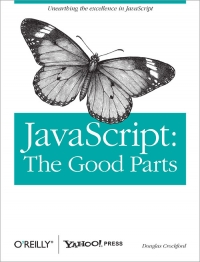
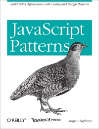
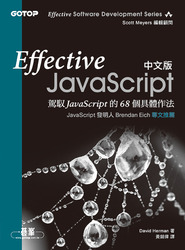
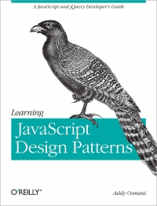
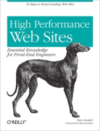

## Proposal Study

### JavaScript: The Good Parts

[ebook](http://it-ebooks.info/book/274/)

### JavaScript Patterns

[ebook](http://it-ebooks.info/book/275/)

### Effective JavaScript 中文版－駕馭 JavaScript 的 68 個具體作法 (Effective JavaScript: 68 Specific Ways to Harness the Power of JavaScript)

[link](https://www.tenlong.com.tw/items/9862768924)

### Learning JavaScript Design Patterns

[ebook](http://it-ebooks.info/book/724/)

### High Performance Web Sites

[ebook](http://www.it-ebooks.info/book/258/)
